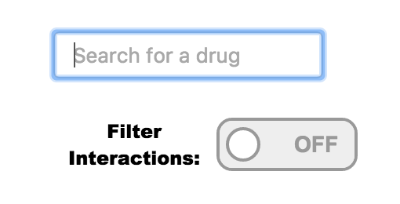
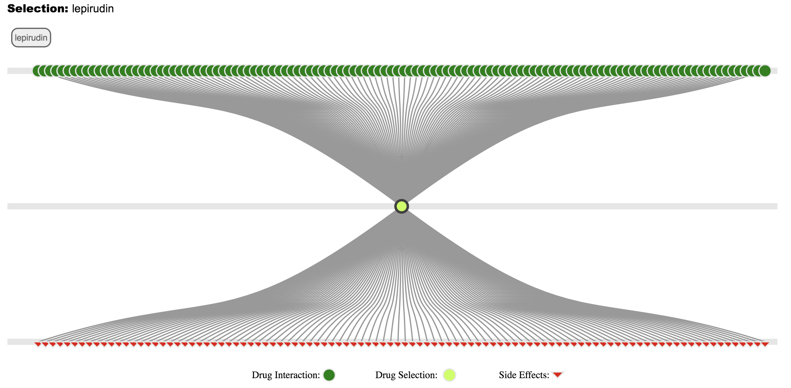
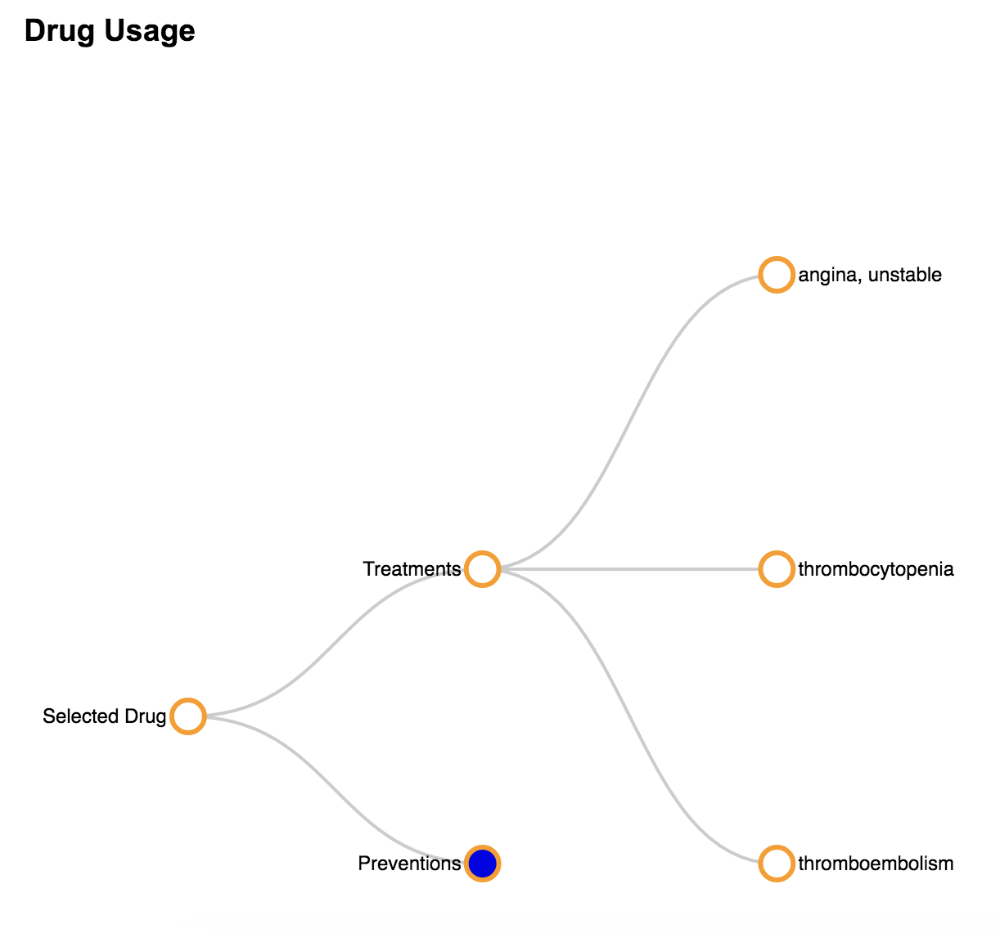
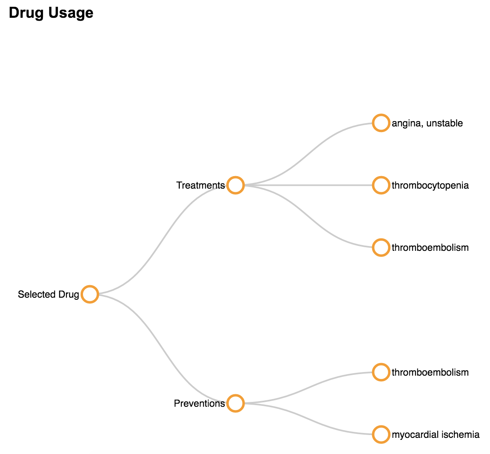
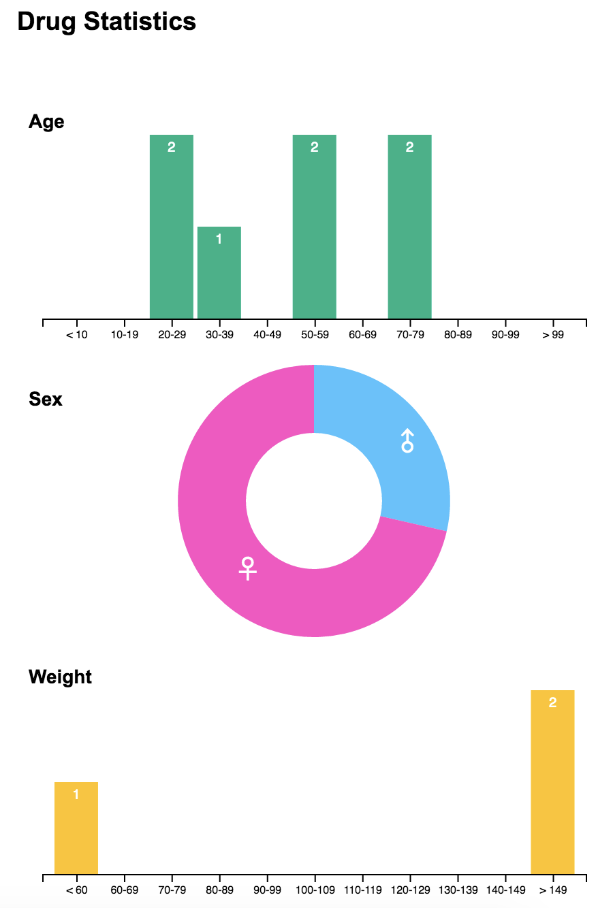

## Authors: Leandro Watanabe and Tramy Nguyen

An interactive visualization to see if combinations of drug medicine can lead to drug-drug interactions.
It is a tool to explore if there is any correlation between patient’s background to a certain drug reaction and
discover what kind of drug we can use to treat a given symptom.

## Prerequisites:
1. An internet browser to view the project in.

2. To be able to get the visualization to search for drugs, ensure that a server is available to use.

For example:
cd path/to/PharmViz

Note: Running with python 2
python -m SimpleHTTPServer

Running with python 3
python -m http.server
Then run the index.html file on the localhost

## Running the project:
Start off by entering a drug.

## Acknowledgements:
Dataset was taken from DrugBank database, FDA database, and RxClass Browser database. 

